# Data Model

The foundation schema is implemented in `database/migrations/001_foundation.sql`.

```mermaid
erDiagram
    STAFF ||--o| USER_ACCOUNT : has
    USER_ACCOUNT ||--o{ AUTH_IDENTITY : signs_in_with
    USER_ACCOUNT ||--o{ USER_ROLE : assigned
    ROLE ||--o{ USER_ROLE : grants
    ROLE ||--o{ ROLE_PERMISSION : contains
    PERMISSION ||--o{ ROLE_PERMISSION : defines

    STAFF ||--o{ STAFF_ORG_MEMBERSHIP : belongs_to
    ORG_UNIT ||--o{ STAFF_ORG_MEMBERSHIP : contains
    USER_ACCOUNT ||--o{ ACCESS_SCOPE : scoped_to
    ORG_UNIT ||--o{ ACCESS_SCOPE : limits_access

    LOOKUP_TYPE ||--o{ LOOKUP_VALUE : owns

    MODULE ||--o{ RECORD : creates
    RECORD ||--o{ ACTIVITY : may_be
    RECORD ||--o{ FORM_SUBMISSION : captures
    FORM_TEMPLATE_VERSION ||--o{ FORM_SUBMISSION : used_by
    FORM_TEMPLATE ||--o{ FORM_TEMPLATE_VERSION : versions
    FORM_TEMPLATE_VERSION ||--o{ FORM_SECTION : contains
    FORM_SECTION ||--o{ FORM_FIELD : contains
    FORM_FIELD ||--o{ FORM_RESPONSE : answered_by
    FORM_SUBMISSION ||--o{ FORM_RESPONSE : contains
    LOOKUP_TYPE ||--o{ FORM_FIELD : provides_options

    ACTIVITY ||--o| LEARNING_WALK_DETAIL : specialises
    ACTIVITY ||--o| WORK_SCRUTINY_DETAIL : specialises

    RECORD ||--o{ ACTION : source
    STAFF ||--o{ ACTION : subject
    STAFF ||--o{ ACTION : owner

    STAFF ||--o{ CPD_ATTENDANCE : attends
    RECORD ||--o| CPD_EVENT : cpd_record
    CPD_EVENT ||--o{ CPD_ATTENDANCE : has

    STAFF ||--o{ EVIDENCE : submits
    RECORD ||--o{ EVIDENCE : relates_to
    EVIDENCE ||--o{ FILE_ATTACHMENT : has
    FILE_ASSET ||--o{ FILE_ATTACHMENT : stored_as

    USER_ACCOUNT ||--o{ AUDIT_LOG : performs
    RECORD ||--o{ AUDIT_LOG : affected
    USER_ACCOUNT ||--o{ NOTIFICATION : receives
    ACTION ||--o{ NOTIFICATION : may_trigger
    DASHBOARD ||--o{ SAVED_REPORT_VIEW : configures
    USER_ACCOUNT ||--o{ SAVED_REPORT_VIEW : owns
```

## Key Design Choices

- GUID primary keys are used for stable relational identity.
- Human-readable codes are stored separately where useful for imports and reports.
- Roles and permissions are many-to-many, not checkbox columns.
- Organisation is generic so the same table supports faculty, department, team, and future structures.
- `core.records` is the universal attachment point for forms, evidence, actions, audit, and reports.
- Module-specific detail tables exist only for stable fields that need filtering or reporting.
- CPD uses separate managed-event and external self-log form templates. Both create a
  `CPD_EVENT`; self-logs create attendance only for the authenticated staff member.
- `CPD_EVENT.duration_minutes` stores normalized duration while the form submission
  preserves the entered hour and minute components.

